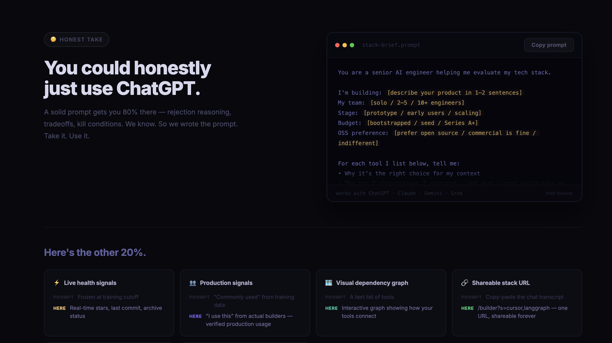
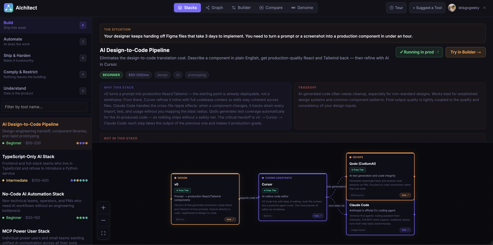
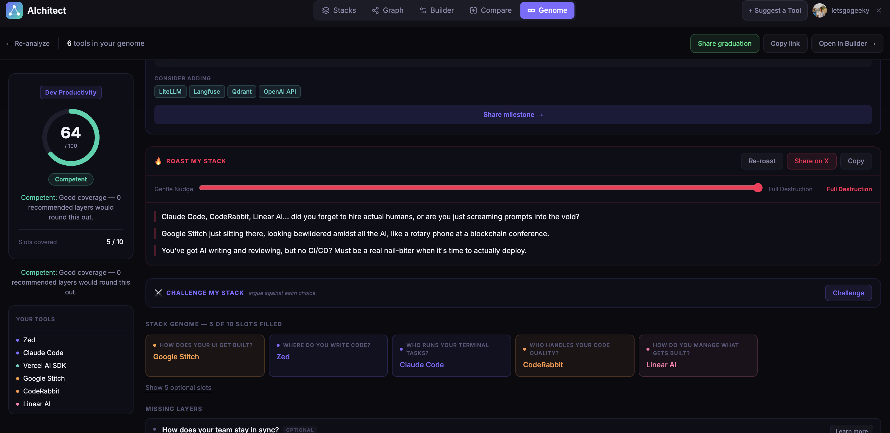
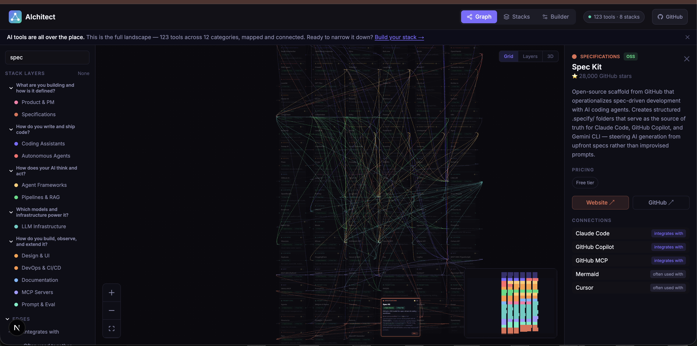

<div align="center">
  
  <h1>AIchitect</h1>
  <p><strong>Cut the noise. Pick your AI stack.</strong></p>
  <p>An open-source, interactive map of the AI tooling ecosystem.</p>

  <p>
    <a href="https://aichitect.dev">aichitect.dev</a> ·
    <a href="https://aichitect.dev/explore">Explore Graph</a> ·
    <a href="https://aichitect.dev/stacks">Stacks</a> ·
    <a href="https://aichitect.dev/builder">Builder</a> ·
    <a href="https://aichitect.dev/compare">Compare</a> ·
    <a href="https://aichitect.dev/genome">Genome</a>
  </p>

  
  
  
  
  
</div>

---

## Screenshots

|                     Landing                     |                    Stacks                     |
| :---------------------------------------------: | :-------------------------------------------: |
|  |  |

|                      Genome                       |                     Graph                     |
| :-----------------------------------------------: | :-------------------------------------------: |
|  |  |

---

AI tools are all over the place. Every week there's a new framework, a new model, a new "essential" addition to your stack. AIchitect gives you a structured, visual map of the ecosystem — **207 tools** across **16 categories** — with their integrations and relationships mapped out so you can pick the right stack based on data, not hype.

## Features

### Graph View — Explore the full ecosystem

Browse all 207 tools as an interactive force graph. Filter by category or relationship type, search by name, and switch between three view modes:

- **2D Grid** — clean, scannable card layout
- **2D Layers** — swimlane view organized by stack layer (Development → AI Logic → Models & Infra → Tooling)
- **3D** — rotatable Three.js force graph with orbit controls

### Stacks — 25 mission-driven starting points

Stacks are organized as **mission briefings**, not tool catalogs. Each stack leads with the specific situation it solves, lists what was explicitly rejected and why, and tells you exactly when to move on. 25 stacks across 5 decision clusters:

| Cluster               | Tagline                     | Stacks                                                                                                       |
| --------------------- | --------------------------- | ------------------------------------------------------------------------------------------------------------ |
| **Build**             | Ship this week              | Indie Hacker, Design-to-Code, MCP Power User, No-Code AI, TypeScript-Only, Zero-Budget OSS                   |
| **Automate**          | AI does the work            | Agentic Coding, Multi-Agent DevOps, Browser Agent, Voice AI, Data + AI Pipeline                              |
| **Ship & Harden**     | Make it trustworthy         | LLM Production Infra, Evaluation & Quality, Spec-Driven AI, Cost Reduction, Multi-Modal RAG, Legacy App + AI |
| **Comply & Restrict** | Nothing leaves the building | OSS Self-Hosted, EU/GDPR Regulated, Edge/On-Device, AI Red-Team                                              |
| **Understand**        | Data is the product         | Enterprise RAG, Fine-Tuning Pipeline, Document Intelligence, Research & Synthesis                            |

Each stack includes:

- **The Situation** — the specific mission and constraints it was built for
- **Why this stack** — the reasoning behind every tool choice
- **Not in this stack** — tools that were considered and explicitly rejected, with reasons
- **When to move on** — the kill conditions that signal it's time to graduate
- **Graduate to →** — the next stack in the natural progression

### Builder — Design your own stack

Pick one tool per slot and watch your stack wire together with live integration edges. Share your exact stack via a single URL (`?s=cursor,langgraph,openai-api,...`).

### Compare — Side-by-side tool analysis

Compare any two tools head-to-head: category, pricing, OSS vs. SaaS, GitHub stars, integrations, and a plain-language summary of the tradeoffs. Shareable via URL (`/compare/cursor/windsurf`).

### Genome — Analyse your existing stack

Paste your dependency files (`package.json`, `requirements.txt`, `.env`, etc.) and Genome detects which AI tools you're already using, scores your stack's fitness, and surfaces gaps and swap recommendations:

- **Fitness score** — arc gauge showing your stack's overall health tier
- **Detected tools** — maps your deps to known tools via aliases, env vars, and config file patterns
- **Gap analysis** — flags required slots your stack doesn't fill
- **Swap recommendations** — suggests replacements for stale or low-health tools in the same slot
- **Roast mode** — opinionated, personality-driven feedback on your choices

## MCP Server

### Stack intelligence in your AI editor

AIchitect is available as a remote MCP server. Add it once and use it from Claude Code, Cursor, Windsurf, or any MCP-compatible client.

**URL:** `https://aichitect.dev/api/mcp`

**Claude Code** — add to `~/.claude/settings.json`:

```json
{
  "mcpServers": {
    "aichitect": {
      "type": "http",
      "url": "https://aichitect.dev/api/mcp"
    }
  }
}
```

**Available tools:**

- `roast_stack` — roast an AI stack by tool name
- `challenge_stack` — adversarial critique of your tool choices
- `get_stack_questions` + `recommend_stack` — questionnaire-driven stack recommendation

[Full setup guide →](https://aichitect.dev/mcp)

## Tech Stack

| Layer     | Technology                         |
| --------- | ---------------------------------- |
| Framework | Next.js 16 (App Router, Turbopack) |
| 2D Graph  | React Flow v11                     |
| 3D Graph  | react-force-graph-3d + Three.js    |
| Styling   | Tailwind CSS v4                    |
| Language  | TypeScript                         |
| Dev       | Docker + Docker Compose            |

## Getting Started

All dev runs through Docker — no local Node.js required.

```bash
# Clone
git clone https://github.com/letsgogeeky/aichitect.git
cd aichitect

# Start dev server (hot reload on http://localhost:3000)
make run

# Stop
make down
```

### Common commands

```bash
make run          # Start dev server in foreground (hot reload)
make down         # Stop and remove containers
make rebuild      # Full rebuild after adding new packages
make logs         # Tail container logs
make shell        # Open shell inside the running container
make typecheck    # Run tsc --noEmit
make lint         # Run ESLint
make sync-counts  # Sync tool/category/stack counts into README.md and CLAUDE.md
```

> Requires [Docker](https://docs.docker.com/get-docker/) and Docker Compose.

## Project Structure

```
app/
  page.tsx                        # Landing page
  explore/                        # Graph view (FilterPanel + ExploreGraph + DetailPanel)
  stacks/                         # 25 mission-driven stacks (cluster sidebar + dagre graph)
  builder/                        # Stack builder (slot picker + integration graph)
  compare/[toolA]/[toolB]/        # Side-by-side tool comparison
  badge/                          # SVG badge endpoint (/badge?s=cursor,langgraph,...)
  opengraph-image.tsx             # Root OG image (1200×630, edge runtime)
  robots.ts                       # /robots.txt
  sitemap.ts                      # /sitemap.xml
components/
  graph/
    ExploreGraph.tsx              # Main graph; switches between grid / layers / 3D modes
    ExploreGraph3D.tsx            # Three.js 3D force graph (SSR-disabled)
    ToolNode.tsx                  # Collapsible card node (190px ↔ 280px)
  panels/
    FilterPanel.tsx               # Category + relationship filters, search
    DetailPanel.tsx               # Tool detail slide-in panel
    ComparisonPanel.tsx           # Side-by-side tool comparison panel
  ui/
    Navbar.tsx                    # Top nav with route-aware controls
    Logo.tsx                      # SVG logo component
data/
  tools.json            # 207 tools, 16 categories
  relationships.json    # ~452 edges (integrates-with / commonly-paired-with / competes-with)
  stacks.json           # 25 curated stacks across 5 clusters
  slots.json            # 15 builder slot types
lib/
  types.ts              # TypeScript interfaces + getCategoryColor() + STACK_CLUSTERS
  graph.ts              # Dagre, grid, and swimlane layout functions
  constants.ts          # SITE_URL, GITHUB_URL, TOOL_COUNT, etc. (auto-derived from data)
  stackStory.ts         # Generates prose narrative from stack selection
scripts/
  sync-counts.mjs       # Patches count references in README.md and CLAUDE.md
```

## Contributing

Contributions are welcome — tools, stacks, bug fixes, and new features.

### Adding a tool

1. Add an entry to `data/tools.json`:

```json
{
  "id": "my-tool",
  "name": "My Tool",
  "category": "agent-frameworks",
  "tagline": "One sentence description",
  "description": "Longer description shown in the detail panel.",
  "type": "oss",
  "pricing": { "free_tier": true, "plans": [] },
  "github_stars": 12000,
  "slot": "orchestration",
  "prominent": false,
  "urls": { "website": "https://mytool.dev", "github": "https://github.com/org/repo" }
}
```

2. Optionally add edges in `data/relationships.json`:

```json
{ "source": "my-tool", "target": "langchain", "type": "integrates-with" }
```

Counts in `lib/constants.ts`, `README.md`, and `CLAUDE.md` are updated automatically on the next commit via the pre-commit hook.

### Adding a stack

Add an entry to `data/stacks.json`. Each stack requires the full schema:

```json
{
  "id": "my-stack",
  "name": "My Stack Name",
  "description": "One-line description of what this stack does.",
  "target": "Who this stack is for.",
  "cluster": "build",
  "mission": "The specific situation and constraints this stack was assembled for — vivid, first-person, urgent.",
  "not_in_stack": [{ "tool": "tool-id", "reason": "Why this plausible tool was explicitly cut." }],
  "kill_conditions": ["When this stack should be retired — specific trigger conditions."],
  "graduates_to": "next-stack-id",
  "tags": ["tag1", "tag2"],
  "why": "The reasoning behind every tool choice in this stack.",
  "tradeoffs": "Honest description of where this stack falls short.",
  "complexity": "beginner",
  "monthly_cost": "$50–150",
  "tools": ["tool-id-1", "tool-id-2"],
  "flow": [{ "from": "tool-id-1", "to": "tool-id-2", "label": "relationship description" }]
}
```

`cluster` must be one of: `build` · `automate` · `ship` · `comply` · `understand`

All tool IDs in `tools`, `not_in_stack`, `flow.from`, and `flow.to` must exist in `data/tools.json`.

### Opening an issue

Found a missing tool, broken edge, or UI bug? [Open an issue](https://github.com/letsgogeeky/aichitect/issues) — all feedback is welcome.

### Pull requests

1. Fork the repo
2. Create a branch: `git checkout -b feat/my-change`
3. Make your changes and verify with `make check` (lint + typecheck + tests)
4. Open a PR with a clear description of what changed and why

## License

[MIT](LICENSE) — free to use, modify, and distribute.

---

<div align="center">
  <sub>Built with ❤️ for the AI engineering community · <a href="https://aichitect.dev">aichitect.dev</a></sub>
</div>
