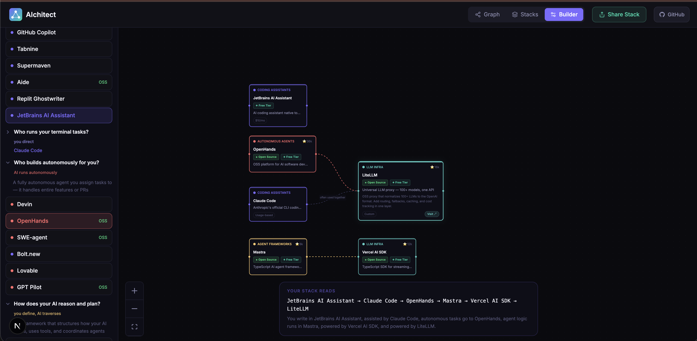

<div align="center">
  
  <h1>AIchitect</h1>
  <p><strong>Cut the noise. Pick your AI stack.</strong></p>
  <p>An open-source, interactive map of the AI tooling ecosystem.</p>

  <p>
    <a href="https://aichitect.dev">aichitect.dev</a> ·
    <a href="https://aichitect.dev/explore">Explore Graph</a> ·
    <a href="https://aichitect.dev/stacks">Stacks</a> ·
    <a href="https://aichitect.dev/builder">Builder</a>
  </p>

  
  
  
  
</div>

---

## Screenshots

| Builder | Stacks |
|:---:|:---:|
|  |  |

---

AI tools are all over the place. Every week there's a new framework, a new model, a new "essential" addition to your stack. AIchitect gives you a structured, visual map of the ecosystem — **111 tools** across **11 categories** — with their integrations and relationships mapped out so you can pick the right stack based on data, not hype.

## Features

### Graph View — Explore the full ecosystem
Browse all 111 tools as an interactive force graph. Filter by category or relationship type, search by name, and switch between three view modes:
- **2D Grid** — clean, scannable card layout
- **2D Layers** — swimlane view organized by stack layer (Development → AI Logic → Models & Infra → Tooling)
- **3D** — rotatable Three.js force graph with orbit controls

### Stacks — 8 curated starting points
Pre-built stacks for common AI engineering patterns, each visualized as an integration diagram:

| Stack | Description |
|---|---|
| Indie Hacker | Solo developer, fast shipping, minimal ops |
| Enterprise RAG | Production RAG pipeline with observability |
| OSS Self-Hosted | Fully open-source, self-hostable stack |
| Agentic DevOps | Autonomous coding + CI/CD agent loop |
| Multi-Agent Research | Multi-agent coordination for deep research |
| LLM Fine-tuning | Model fine-tuning and evaluation workflow |
| Voice AI | Real-time voice + LLM pipeline |
| Edge AI | Lightweight inference at the edge |

### Builder — Design your own stack
Pick one tool per slot and watch your stack wire together with live integration edges. Share your exact stack via a single URL (`?s=cursor,langgraph,gpt-4o,...`).

## Tech Stack

| Layer | Technology |
|---|---|
| Framework | Next.js 16 (App Router, Turbopack) |
| 2D Graph | React Flow v11 |
| 3D Graph | react-force-graph-3d + Three.js |
| Styling | Tailwind CSS v4 |
| Language | TypeScript |
| Dev | Docker + Docker Compose |

## Getting Started

All dev runs through Docker — no local Node.js required.

```bash
# Clone
git clone https://github.com/letsgogeeky/aichitect.git
cd aichitect

# Start dev server (hot reload on http://localhost:3000)
make run

# Stop
make down
```

### Common commands

```bash
make run        # Start dev server in foreground (hot reload)
make down       # Stop and remove containers
make rebuild    # Full rebuild after adding new packages
make logs       # Tail container logs
make shell      # Open shell inside the running container
make typecheck  # Run tsc --noEmit
make lint       # Run ESLint
```

> Requires [Docker](https://docs.docker.com/get-docker/) and Docker Compose.

## Project Structure

```
app/
  page.tsx              # Landing page
  explore/              # Graph view (FilterPanel + ExploreGraph + DetailPanel)
  stacks/               # Curated stacks (sidebar + dagre graph)
  builder/              # Stack builder (slot picker + integration graph)
components/
  graph/
    ExploreGraph.tsx    # Main graph; switches between grid / layers / 3D modes
    ExploreGraph3D.tsx  # Three.js 3D force graph (SSR-disabled)
    ToolNode.tsx        # Collapsible card node (190px ↔ 280px)
  panels/
    FilterPanel.tsx     # Category + relationship filters, search
    DetailPanel.tsx     # Tool detail slide-in panel
  ui/
    Navbar.tsx          # Top nav with route-aware controls
    Logo.tsx            # SVG logo component
data/
  tools.json            # 111 tools
  relationships.json    # ~243 edges
  stacks.json           # 8 curated stacks
  slots.json            # 15 builder slot types
lib/
  types.ts              # TypeScript interfaces + getCategoryColor()
  graph.ts              # Dagre, grid, and swimlane layout functions
  constants.ts          # SITE_URL, GITHUB_URL, TOOL_COUNT, etc.
  stackStory.ts         # Generates prose narrative from stack selection
```

## Contributing

Contributions are welcome — tools, stacks, bug fixes, and new features.

### Adding a tool

1. Add an entry to `data/tools.json`:
```json
{
  "id": "my-tool",
  "name": "My Tool",
  "category": "agent-frameworks",
  "tagline": "One sentence description",
  "description": "Longer description shown in the detail panel.",
  "type": "oss",
  "pricing": { "free_tier": true, "plans": [] },
  "github_stars": 12000,
  "slot": "orchestration",
  "prominent": false,
  "urls": { "website": "https://mytool.dev", "github": "https://github.com/org/repo" }
}
```

2. Optionally add edges in `data/relationships.json`:
```json
{ "source": "my-tool", "target": "langchain", "type": "integrates-with" }
```

3. Update `TOOL_COUNT` in `lib/constants.ts`.

### Adding a stack

Add an entry to `data/stacks.json` following the existing format.

### Opening an issue

Found a missing tool, broken edge, or UI bug? [Open an issue](https://github.com/letsgogeeky/aichitect/issues) — all feedback is welcome.

### Pull requests

1. Fork the repo
2. Create a branch: `git checkout -b feat/my-change`
3. Make your changes and verify with `make typecheck`
4. Open a PR with a clear description of what changed and why

## License

[MIT](LICENSE) — free to use, modify, and distribute.

---

<div align="center">
  <sub>Built with ❤️ for the AI engineering community · <a href="https://aichitect.dev">aichitect.dev</a></sub>
</div>
